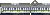
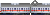

<table class="ko_train_set">
    <tr data-veh_id="HOKEY7">
        <td class="refit">

</td>
        <td class="name">Hokey 7 Steam Locomotive</td>
        <td class="speed">50 km/h</td>
        <td class="speed_designed">50 km/h</td>
        <td class="capacity"></td>
        <td class="power">150 kW</td>
        <td class="weight">43 t</td>
        <td class="introduction">1952</td>
    </tr>
    <tr data-veh_id="MIKA3">
        <td class="refit">

</td>
        <td class="name">Mika 3 Steam Locomotive</td>
        <td class="speed">70 km/h</td>
        <td class="speed_designed">70 km/h</td>
        <td class="capacity"></td>
        <td class="power">726 kW</td>
        <td class="weight">156 t</td>
        <td class="introduction">1927</td>
    </tr>
    <tr data-veh_id="PASHI5">
        <td class="refit">

</td>
        <td class="name">Pashi 5 Steam Locomotive</td>
        <td class="speed">110 km/h</td>
        <td class="speed_designed">110 km/h</td>
        <td class="capacity"></td>
        <td class="power">790 kW</td>
        <td class="weight">196 t</td>
        <td class="introduction">1939</td>
    </tr>
    <tr data-veh_id="MATE2">
        <td class="refit">

</td>
        <td class="name">Mate 2 Steam Locomotive</td>
        <td class="speed">90 km/h</td>
        <td class="speed_designed">90 km/h</td>
        <td class="capacity"></td>
        <td class="power">1074 kW</td>
        <td class="weight">179 t</td>
        <td class="introduction">1943</td>
    </tr>
    <tr data-veh_id="K2X00">
        <td class="refit">
   
</td>
        <td class="name">2x00 Diesel Locomotive</td>
        <td class="speed">105 km/h</td>
        <td class="speed_designed">105 km/h</td>
        <td class="capacity"></td>
        <td class="power">597 kW</td>
        <td class="weight">95 t</td>
        <td class="introduction">1955</td>
    </tr>
    <tr data-veh_id="K4X00">
        <td class="refit">
  
</td>
        <td class="name">4x00 Diesel Locomotive</td>
        <td class="speed">105 km/h</td>
        <td class="speed_designed">105 km/h</td>
        <td class="capacity"></td>
        <td class="power">1230 kW</td>
        <td class="weight">88 t</td>
        <td class="introduction">2001</td>
    </tr>
    <tr data-veh_id="K5000">
        <td class="refit">

</td>
        <td class="name">5000 Diesel Locomotive</td>
        <td class="speed">115 km/h</td>
        <td class="speed_designed">105 km/h</td>
        <td class="capacity"></td>
        <td class="power">2347 kW</td>
        <td class="weight">141 t</td>
        <td class="introduction">1957</td>
    </tr>
    <tr data-veh_id="K7000">
        <td class="refit">
  
</td>
        <td class="name">7000 Diesel Locomotive</td>
        <td class="speed">150 km/h</td>
        <td class="speed_designed">150 km/h</td>
        <td class="capacity"></td>
        <td class="power">2460 kW</td>
        <td class="weight">119 t</td>
        <td class="introduction">1986</td>
    </tr>
    <tr data-veh_id="K7X00">
        <td class="refit">
        
</td>
        <td class="name">7x00 Diesel Locomotive</td>
        <td class="speed">150 km/h</td>
        <td class="speed_designed">150 km/h</td>
        <td class="capacity"></td>
        <td class="power">2238 kW</td>
        <td class="weight">130 t</td>
        <td class="introduction">1971</td>
    </tr>
    <tr data-veh_id="K7600">
        <td class="refit">
 
</td>
        <td class="name">7600 Diesel Locomotive</td>
        <td class="speed">150 km/h</td>
        <td class="speed_designed">165 km/h</td>
        <td class="capacity"></td>
        <td class="power">2602 kW</td>
        <td class="weight">132 t</td>
        <td class="introduction">2014</td>
    </tr>
    <tr data-veh_id="K8000">
        <td class="refit">
  
</td>
        <td class="name">8000 Electronic Locomotive</td>
        <td class="speed">85 km/h</td>
        <td class="speed_designed">90 km/h</td>
        <td class="capacity"></td>
        <td class="power">3952 kW</td>
        <td class="weight">132 t</td>
        <td class="introduction">1972</td>
    </tr>
    <tr data-veh_id="K8X00">
        <td class="refit">
 
</td>
        <td class="name">8x00 Electronic Locomotive</td>
        <td class="speed">150 km/h</td>
        <td class="speed_designed">220 km/h</td>
        <td class="capacity"></td>
        <td class="power">5200 kW</td>
        <td class="weight">88 t</td>
        <td class="introduction">1990</td>
    </tr>
    <tr data-veh_id="K8500">
        <td class="refit">

</td>
        <td class="name">8500 Electronic Locomotive</td>
        <td class="speed">150 km/h</td>
        <td class="speed_designed">165 km/h</td>
        <td class="capacity"></td>
        <td class="power">6600 kW</td>
        <td class="weight">132 t</td>
        <td class="introduction">2012</td>
    </tr>
    <tr data-veh_id="DHC">
        <td class="refit">
  
</td>
        <td class="name">Diesel Hydraulic Car (DHC, PP)</td>
        <td class="speed">150 km/h</td>
        <td class="speed_designed">150 km/h</td>
        <td class="capacity">22</td>
        <td class="power">4474 kW</td>
        <td class="weight">70 t</td>
        <td class="introduction">1987</td>
    </tr>
    <tr data-veh_id="ITX_SAEMAEUL">
        <td class="refit">

</td>
        <td class="name">ITX-Saemaeul</td>
        <td class="speed">150 km/h</td>
        <td class="speed_designed">165 km/h</td>
        <td class="capacity">58</td>
        <td class="power">6000 kW</td>
        <td class="weight">45 t</td>
        <td class="introduction">2014</td>
    </tr>
    <tr data-veh_id="NURIRO">
        <td class="refit">
   
</td>
        <td class="name">Nuriro</td>
        <td class="speed">150 km/h</td>
        <td class="speed_designed">165 km/h</td>
        <td class="capacity">64</td>
        <td class="power">4000 kW</td>
        <td class="weight">45 t</td>
        <td class="introduction">2010</td>
    </tr>
    <tr data-veh_id="BIDULGI_CDC">
        <td class="refit">
     
</td>
        <td class="name">Commuter Diesel Car (RC)</td>
        <td class="speed">110 km/h</td>
        <td class="speed_designed">110 km/h</td>
        <td class="capacity">150</td>
        <td class="power">261 kW</td>
        <td class="weight">37 t</td>
        <td class="introduction">1961</td>
    </tr>
    <tr data-veh_id="NARROW_DIESEL_CAR">
        <td class="refit">
  
</td>
        <td class="name">Narrow gauge Diesel Car</td>
        <td class="speed">55 km/h</td>
        <td class="speed_designed">55 km/h</td>
        <td class="capacity">90</td>
        <td class="power">149 kW</td>
        <td class="weight">21 t</td>
        <td class="introduction">1965</td>
    </tr>
    <tr data-veh_id="CDC">
        <td class="refit">
          
</td>
        <td class="name">Commuter Diesel Car (CDC)</td>
        <td class="speed">120 km/h</td>
        <td class="speed_designed">120 km/h</td>
        <td class="capacity">64</td>
        <td class="power">800 kW</td>
        <td class="weight">50 t</td>
        <td class="introduction">1996</td>
    </tr>
    <tr data-veh_id="NDC">
        <td class="refit">
  
</td>
        <td class="name">New Diesel Car (NDC)</td>
        <td class="speed">120 km/h</td>
        <td class="speed_designed">120 km/h</td>
        <td class="capacity">44</td>
        <td class="power">455 kW</td>
        <td class="weight">50 t</td>
        <td class="introduction">1984</td>
    </tr>
    <tr data-veh_id="DEC">
        <td class="refit">
  
</td>
        <td class="name">Diesel Electric Car (DEC)</td>
        <td class="speed">110 km/h</td>
        <td class="speed_designed">110 km/h</td>
        <td class="capacity">28</td>
        <td class="power">807 kW</td>
        <td class="weight">62 t</td>
        <td class="introduction">1980</td>
    </tr>
    <tr data-veh_id="EEC">
        <td class="refit">
  
</td>
        <td class="name">Express Electric Car (EEC)</td>
        <td class="speed">110 km/h</td>
        <td class="speed_designed">110 km/h</td>
        <td class="capacity">56</td>
        <td class="power">2880 kW</td>
        <td class="weight">43 t</td>
        <td class="introduction">1980</td>
    </tr>
    <tr data-veh_id="KTX1N">
        <td class="refit">

</td>
        <td class="name">KTX-1</td>
        <td class="speed">305 km/h</td>
        <td class="speed_designed">320 km/h</td>
        <td class="capacity"></td>
        <td class="power">13200 kW</td>
        <td class="weight">68 t</td>
        <td class="introduction">2004</td>
    </tr>
    <tr data-veh_id="KTX2N">
        <td class="refit">
 
</td>
        <td class="name">KTX-Sancheon</td>
        <td class="speed">305 km/h</td>
        <td class="speed_designed">320 km/h</td>
        <td class="capacity"></td>
        <td class="power">8800 kW</td>
        <td class="weight">68 t</td>
        <td class="introduction">2009</td>
    </tr>
    <tr data-veh_id="SRT">
        <td class="refit">

</td>
        <td class="name">SRT</td>
        <td class="speed">305 km/h</td>
        <td class="speed_designed">320 km/h</td>
        <td class="capacity"></td>
        <td class="power">8800 kW</td>
        <td class="weight">68 t</td>
        <td class="introduction">2015</td>
    </tr>
    <tr data-veh_id="EUM">
        <td class="refit">

</td>
        <td class="name">KTX-EUM</td>
        <td class="speed">260 km/h</td>
        <td class="speed_designed">286 km/h</td>
        <td class="capacity">76</td>
        <td class="power">8800 kW</td>
        <td class="weight">60 t</td>
        <td class="introduction">2019</td>
    </tr>
    <tr data-veh_id="SAEMAEUL_CAR">
        <td class="refit">
      
</td>
        <td class="name">Saemaeul passenger car</td>
        <td class="speed">150 km/h</td>
        <td class="speed_designed">150 km/h</td>
        <td class="capacity">64</td>
        <td class="power"></td>
        <td class="weight">20 t</td>
        <td class="introduction">1984</td>
    </tr>
    <tr data-veh_id="MUGUNGHWA_CAR">
        <td class="refit">
                
</td>
        <td class="name">Mugunghwa passenger car</td>
        <td class="speed">135 km/h</td>
        <td class="speed_designed">135 km/h</td>
        <td class="capacity">72</td>
        <td class="power"></td>
        <td class="weight">17 t</td>
        <td class="introduction">1972</td>
    </tr>
    <tr data-veh_id="TONGIL_CAR">
        <td class="refit">
      
</td>
        <td class="name">Tongil passenger car</td>
        <td class="speed">120 km/h</td>
        <td class="speed_designed">120 km/h</td>
        <td class="capacity">72</td>
        <td class="power"></td>
        <td class="weight">17 t</td>
        <td class="introduction">1984</td>
    </tr>
    <tr data-veh_id="BIDULGI_CAR">
        <td class="refit">
     
</td>
        <td class="name">Bidulgi passenger car</td>
        <td class="speed">110 km/h</td>
        <td class="speed_designed">110 km/h</td>
        <td class="capacity">100</td>
        <td class="power"></td>
        <td class="weight">35 t</td>
        <td class="introduction">1927</td>
    </tr>
    <tr data-veh_id="GENERATOR_CAR">
        <td class="refit">
               
</td>
        <td class="name">Generator car</td>
        <td class="speed">120 km/h</td>
        <td class="speed_designed">120 km/h</td>
        <td class="capacity"></td>
        <td class="power"></td>
        <td class="weight">17 t</td>
        <td class="introduction">1972</td>
    </tr>
    <tr data-veh_id="CAFE_CAR">
        <td class="refit">
          
</td>
        <td class="name">Cafe/Restaurant car</td>
        <td class="speed">120 km/h</td>
        <td class="speed_designed">120 km/h</td>
        <td class="capacity">50</td>
        <td class="power"></td>
        <td class="weight">17 t</td>
        <td class="introduction">1972</td>
    </tr>
    <tr data-veh_id="SEOUL_METRO_1">
        <td class="refit">
                       
</td>
        <td class="name">Seoul Line 1, Commuter trains</td>
        <td class="speed">100 km/h</td>
        <td class="speed_designed">100 km/h</td>
        <td class="capacity">100</td>
        <td class="power">2000 kW</td>
        <td class="weight">20 t</td>
        <td class="introduction">1972</td>
    </tr>
    <tr data-veh_id="SEOUL_METRO_2">
        <td class="refit">
      
</td>
        <td class="name">Seoul Line 2</td>
        <td class="speed">100 km/h</td>
        <td class="speed_designed">100 km/h</td>
        <td class="capacity">100</td>
        <td class="power">2000 kW</td>
        <td class="weight">20 t</td>
        <td class="introduction">1983</td>
    </tr>
    <tr data-veh_id="SEOUL_METRO_3">
        <td class="refit">
     
</td>
        <td class="name">Seoul Line 3</td>
        <td class="speed">100 km/h</td>
        <td class="speed_designed">100 km/h</td>
        <td class="capacity">100</td>
        <td class="power">2000 kW</td>
        <td class="weight">20 t</td>
        <td class="introduction">1983</td>
    </tr>
    <tr data-veh_id="SEOUL_METRO_4">
        <td class="refit">
       
</td>
        <td class="name">Seoul Line 4</td>
        <td class="speed">100 km/h</td>
        <td class="speed_designed">100 km/h</td>
        <td class="capacity">100</td>
        <td class="power">2000 kW</td>
        <td class="weight">20 t</td>
        <td class="introduction">1983</td>
    </tr>
    <tr data-veh_id="SEOUL_METRO_5_9">
        <td class="refit">
        
</td>
        <td class="name">Seoul Line 5~9</td>
        <td class="speed">100 km/h</td>
        <td class="speed_designed">100 km/h</td>
        <td class="capacity">100</td>
        <td class="power">2000 kW</td>
        <td class="weight">20 t</td>
        <td class="introduction">1995</td>
    </tr>
    <tr data-veh_id="SUIN_BUNDANG">
        <td class="refit">
   
</td>
        <td class="name">Suin-Bundang Line</td>
        <td class="speed">100 km/h</td>
        <td class="speed_designed">100 km/h</td>
        <td class="capacity">100</td>
        <td class="power">2000 kW</td>
        <td class="weight">20 t</td>
        <td class="introduction">1993</td>
    </tr>
    <tr data-veh_id="GYEONGCHUN">
        <td class="refit">

</td>
        <td class="name">Gyeongchun Line</td>
        <td class="speed">100 km/h</td>
        <td class="speed_designed">100 km/h</td>
        <td class="capacity">100</td>
        <td class="power">2000 kW</td>
        <td class="weight">20 t</td>
        <td class="introduction">2010</td>
    </tr>
    <tr data-veh_id="ITX_CHEONGCHUN">
        <td class="refit">

</td>
        <td class="name">ITX-Cheongchun</td>
        <td class="speed">180 km/h</td>
        <td class="speed_designed">180 km/h</td>
        <td class="capacity">50</td>
        <td class="power">2000 kW</td>
        <td class="weight">45 t</td>
        <td class="introduction">2012</td>
    </tr>
    <tr data-veh_id="AREX">
        <td class="refit">
  
</td>
        <td class="name">Incheon Airport Railroad (A'REX)</td>
        <td class="speed">110 km/h</td>
        <td class="speed_designed">120 km/h</td>
        <td class="capacity">100</td>
        <td class="power">2000 kW</td>
        <td class="weight">20 t</td>
        <td class="introduction">2007</td>
    </tr>
    <tr data-veh_id="SHINBUNDANG">
        <td class="refit">

</td>
        <td class="name">Shinbundang Line</td>
        <td class="speed">100 km/h</td>
        <td class="speed_designed">100 km/h</td>
        <td class="capacity">100</td>
        <td class="power">2000 kW</td>
        <td class="weight">20 t</td>
        <td class="introduction">2011</td>
    </tr>
    <tr data-veh_id="INCHEON_METRO_1">
        <td class="refit">
 
</td>
        <td class="name">Incheon Line 1</td>
        <td class="speed">100 km/h</td>
        <td class="speed_designed">100 km/h</td>
        <td class="capacity">100</td>
        <td class="power">2000 kW</td>
        <td class="weight">20 t</td>
        <td class="introduction">1999</td>
    </tr>
    <tr data-veh_id="INCHEON_METRO_2">
        <td class="refit">

</td>
        <td class="name">Incheon Line 2</td>
        <td class="speed">80 km/h</td>
        <td class="speed_designed">90 km/h</td>
        <td class="capacity">100</td>
        <td class="power">500 kW</td>
        <td class="weight">32 t</td>
        <td class="introduction">2016</td>
    </tr>
    <tr data-veh_id="BUSAN_METRO_1">
        <td class="refit">
 
</td>
        <td class="name">Busan Line 1</td>
        <td class="speed">100 km/h</td>
        <td class="speed_designed">100 km/h</td>
        <td class="capacity">100</td>
        <td class="power">2000 kW</td>
        <td class="weight">20 t</td>
        <td class="introduction">1985</td>
    </tr>
    <tr data-veh_id="BUSAN_METRO_2">
        <td class="refit">

</td>
        <td class="name">Busan Line 2</td>
        <td class="speed">100 km/h</td>
        <td class="speed_designed">100 km/h</td>
        <td class="capacity">100</td>
        <td class="power">2000 kW</td>
        <td class="weight">20 t</td>
        <td class="introduction">1999</td>
    </tr>
    <tr data-veh_id="BUSAN_METRO_3">
        <td class="refit">

</td>
        <td class="name">Busan Line 3</td>
        <td class="speed">100 km/h</td>
        <td class="speed_designed">100 km/h</td>
        <td class="capacity">100</td>
        <td class="power">2000 kW</td>
        <td class="weight">20 t</td>
        <td class="introduction">1999</td>
    </tr>
    <tr data-veh_id="BUSAN_METRO_4">
        <td class="refit">

</td>
        <td class="name">Busan Line 4</td>
        <td class="speed">60 km/h</td>
        <td class="speed_designed">70 km/h</td>
        <td class="capacity">42</td>
        <td class="power">1000 kW</td>
        <td class="weight">12 t</td>
        <td class="introduction">2011</td>
    </tr>
    <tr data-veh_id="DAEGU_METRO_1">
        <td class="refit">

</td>
        <td class="name">Daegu Line 1</td>
        <td class="speed">100 km/h</td>
        <td class="speed_designed">100 km/h</td>
        <td class="capacity">100</td>
        <td class="power">2000 kW</td>
        <td class="weight">20 t</td>
        <td class="introduction">1997</td>
    </tr>
    <tr data-veh_id="DAEGU_METRO_2">
        <td class="refit">

</td>
        <td class="name">Daegu Line 2</td>
        <td class="speed">100 km/h</td>
        <td class="speed_designed">100 km/h</td>
        <td class="capacity">100</td>
        <td class="power">2000 kW</td>
        <td class="weight">20 t</td>
        <td class="introduction">2005</td>
    </tr>
    <tr data-veh_id="DAEJEON_METRO_1">
        <td class="refit">

</td>
        <td class="name">Daejeon Line 1</td>
        <td class="speed">100 km/h</td>
        <td class="speed_designed">100 km/h</td>
        <td class="capacity">100</td>
        <td class="power">2000 kW</td>
        <td class="weight">20 t</td>
        <td class="introduction">2006</td>
    </tr>
    <tr data-veh_id="GWANGJU_METRO_1">
        <td class="refit">

</td>
        <td class="name">Gwangju Line 1</td>
        <td class="speed">100 km/h</td>
        <td class="speed_designed">100 km/h</td>
        <td class="capacity">100</td>
        <td class="power">2000 kW</td>
        <td class="weight">20 t</td>
        <td class="introduction">2004</td>
    </tr>
    <tr data-veh_id="GIMPO_GOLDLINE">
        <td class="refit">

</td>
        <td class="name">Gimpo Goldline</td>
        <td class="speed">80 km/h</td>
        <td class="speed_designed">90 km/h</td>
        <td class="capacity">100</td>
        <td class="power">500 kW</td>
        <td class="weight">23 t</td>
        <td class="introduction">2019</td>
    </tr>
    <tr data-veh_id="BUSANGIMHAE">
        <td class="refit">

</td>
        <td class="name">Busan-Gimhae LRT</td>
        <td class="speed">70 km/h</td>
        <td class="speed_designed">80 km/h</td>
        <td class="capacity">100</td>
        <td class="power">500 kW</td>
        <td class="weight">23 t</td>
        <td class="introduction">2011</td>
    </tr>
    <tr data-veh_id="DAEGU_METRO_3">
        <td class="refit">

</td>
        <td class="name">Daegu Line 3</td>
        <td class="speed">80 km/h</td>
        <td class="speed_designed">80 km/h</td>
        <td class="capacity">100</td>
        <td class="power">500 kW</td>
        <td class="weight">20 t</td>
        <td class="introduction">2015</td>
    </tr>
    <tr data-veh_id="UISINSEOL">
        <td class="refit">

</td>
        <td class="name">Ui-Sinseol Line</td>
        <td class="speed">70 km/h</td>
        <td class="speed_designed">80 km/h</td>
        <td class="capacity">80</td>
        <td class="power">520 kW</td>
        <td class="weight">23 t</td>
        <td class="introduction">2017</td>
    </tr>
    <tr data-veh_id="YONGIN_EVERLINE">
        <td class="refit">

</td>
        <td class="name">Yongin Everline</td>
        <td class="speed">80 km/h</td>
        <td class="speed_designed">80 km/h</td>
        <td class="capacity">80</td>
        <td class="power">500 kW</td>
        <td class="weight">24 t</td>
        <td class="introduction">2017</td>
    </tr>
    <tr data-veh_id="UIJEONGBU">
        <td class="refit">

</td>
        <td class="name">Uijeongbu LRT</td>
        <td class="speed">80 km/h</td>
        <td class="speed_designed">80 km/h</td>
        <td class="capacity">80</td>
        <td class="power">500 kW</td>
        <td class="weight">16 t</td>
        <td class="introduction">2012</td>
    </tr>
    <tr data-veh_id="ECOBEE">
        <td class="refit">

</td>
        <td class="name">Incheon Intl Airport Maglev (Ecobee)</td>
        <td class="speed">80 km/h</td>
        <td class="speed_designed">110 km/h</td>
        <td class="capacity">186</td>
        <td class="power">500 kW</td>
        <td class="weight">19 t</td>
        <td class="introduction">2012</td>
    </tr>
    <tr data-veh_id="PASSENGER_WAGON">
        <td class="refit">
 
</td>
        <td class="name">Passenger car</td>
        <td class="speed"></td>
        <td class="speed_designed"></td>
        <td class="capacity"></td>
        <td class="power"></td>
        <td class="weight">20 t</td>
        <td class="introduction">1950</td>
    </tr>
    <tr data-veh_id="FLAT_CAR">
        <td class="refit">
  
</td>
        <td class="name">Container flat car</td>
        <td class="speed"></td>
        <td class="speed_designed"></td>
        <td class="capacity">35</td>
        <td class="power"></td>
        <td class="weight">17 t</td>
        <td class="introduction">1950</td>
    </tr>
    <tr data-veh_id="HOPPER_CAR">
        <td class="refit">
  
</td>
        <td class="name">Hopper car</td>
        <td class="speed"></td>
        <td class="speed_designed"></td>
        <td class="capacity">35</td>
        <td class="power"></td>
        <td class="weight">17 t</td>
        <td class="introduction">1950</td>
    </tr>
    <tr data-veh_id="BAGGAGE_CAR">
        <td class="refit">
      
</td>
        <td class="name">Baggage car</td>
        <td class="speed">120 km/h</td>
        <td class="speed_designed">120 km/h</td>
        <td class="capacity">35</td>
        <td class="power"></td>
        <td class="weight">17 t</td>
        <td class="introduction">1950</td>
    </tr>
    <tr data-veh_id="TANK_CAR">
        <td class="refit">
  
</td>
        <td class="name">Tank car</td>
        <td class="speed"></td>
        <td class="speed_designed"></td>
        <td class="capacity">35</td>
        <td class="power"></td>
        <td class="weight">17 t</td>
        <td class="introduction">1950</td>
    </tr>
    <tr data-veh_id="MAIL_CAR">
        <td class="refit">
    
</td>
        <td class="name">Mail car</td>
        <td class="speed"></td>
        <td class="speed_designed"></td>
        <td class="capacity">35</td>
        <td class="power"></td>
        <td class="weight">17 t</td>
        <td class="introduction">1950</td>
    </tr>
    <tr data-veh_id="SLEEPING_CAR">
        <td class="refit">
 
</td>
        <td class="name">Sleeping car</td>
        <td class="speed"></td>
        <td class="speed_designed"></td>
        <td class="capacity">28</td>
        <td class="power"></td>
        <td class="weight">17 t</td>
        <td class="introduction">1966</td>
    </tr>
    <tr data-veh_id="STAKE_CAR">
        <td class="refit">

</td>
        <td class="name">Stake car</td>
        <td class="speed"></td>
        <td class="speed_designed"></td>
        <td class="capacity">35</td>
        <td class="power"></td>
        <td class="weight">17 t</td>
        <td class="introduction">1950</td>
    </tr>
</table>